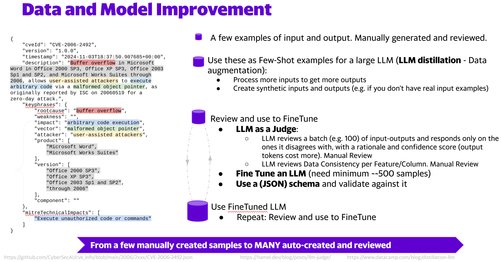
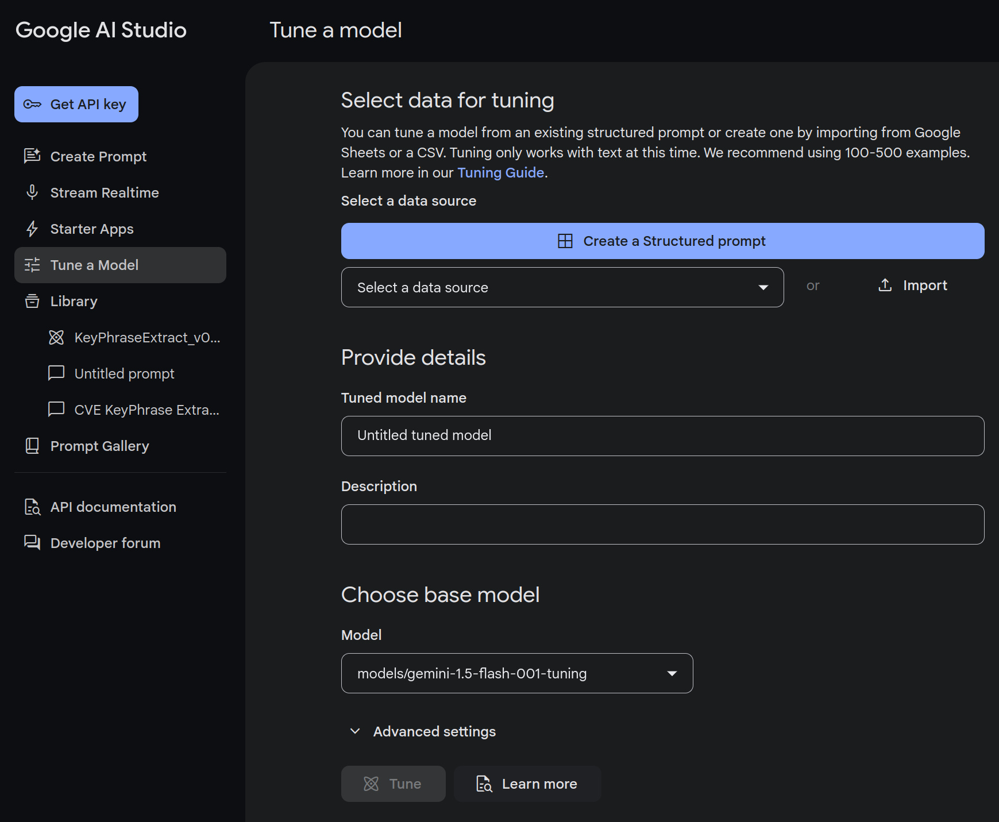
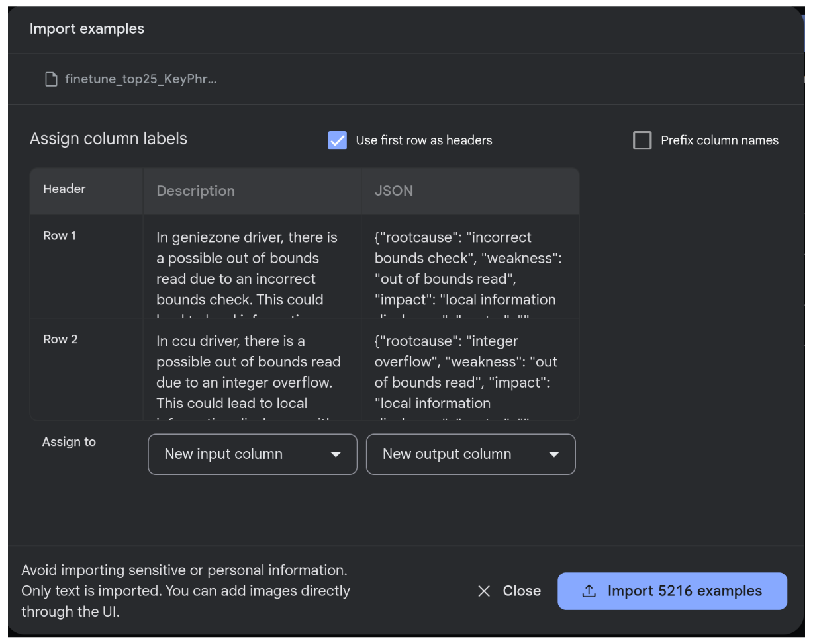
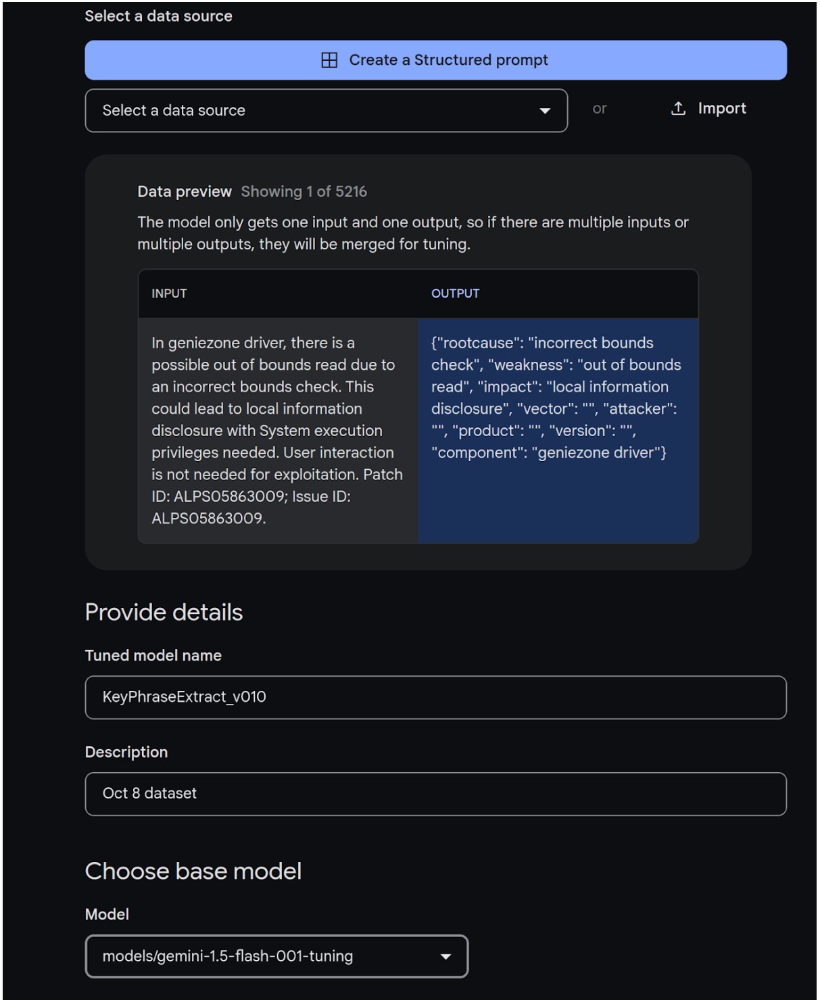
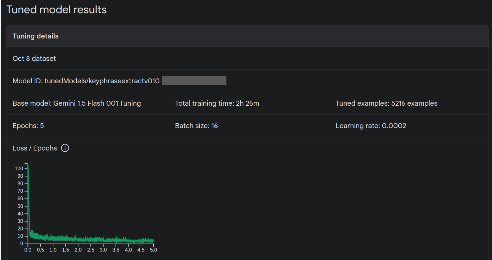

# Overview

>[!IMPORTANT] This is the dataset, and instructions, used to finetune a model to extract keyphrases from 250K CVEs.
>
> A MUCH bigger dataset is coming here soon!
> This will be based on a [compound AI approach](./compound.md).

The following is provided here:
1. A [dataset of 5216 samples](data_in/finetune_top25_KeyPhrase_WeaknessDescription_json.csv) 
2. Instructions to finetune the KeyPhraseExtraction model used to extract the Vulnerability Description KeyPhrases for published CVEs which are stored in https://github.com/CyberSecAI/cve_info.
3. Detail on the [Model Focus](#model-focus) with examples

Table of Contents
- [Overview](#overview)
- [Language Models](#language-models)
  - [Fine Tune Model](#fine-tune-model)
- [Dataset](#dataset)
- [Finetuning](#finetuning)
- [Model Focus](#model-focus)
  - [keyphrases](#keyphrases)
    - [Examples Of complex product, version, component](#examples-of-complex-product-version-component)
    - [Other CVE Examples](#other-cve-examples)
      - [CVE-2018-0004](#cve-2018-0004)
        - [Decscription](#decscription)
        - [Extracted KeyPhrases](#extracted-keyphrases)
      - [CVE-2018-0747](#cve-2018-0747)
        - [Description](#description)
        - [Extracted KeyPhrases](#extracted-keyphrases-1)
      - [CVE-2018-0008](#cve-2018-0008)
        - [Description](#description-1)
        - [Extracted KeyPhrases](#extracted-keyphrases-2)
      - [CVE-2019-10522](#cve-2019-10522)
        - [Description](#description-2)
        - [Extracted KeyPhrases](#extracted-keyphrases-3)
  - [Succinct Over Verbose](#succinct-over-verbose)
    - [Examples](#examples)
      - [CVE-2021-30113](#cve-2021-30113)
        - [Description](#description-3)
        - [Extracted KeyPhrases](#extracted-keyphrases-4)
      - [CVE-2022-36778](#cve-2022-36778)
        - [Description](#description-4)
        - [Extracted KeyPhrases](#extracted-keyphrases-5)
      - [CVE-2022-2653](#cve-2022-2653)
        - [Extracted KeyPhrases](#extracted-keyphrases-6)
      - [CVE-2018-0008](#cve-2018-0008-1)
        - [Description](#description-5)
        - [Extracted KeyPhrases](#extracted-keyphrases-7)
    - [Examples](#examples-1)
      - [CVE-2018-0016](#cve-2018-0016)
      - [CVE-2021-33123](#cve-2021-33123)
  
  


# Language Models

> [!NOTE]  
> Google Gemini 2.0 Flash released https://blog.google/technology/google-deepmind/google-gemini-ai-update-december-2024/, Dec 11, 202

> [!NOTE]  
> Amazon has released its own suite of models per https://www.aboutamazon.com/news/aws/amazon-nova-artificial-intelligence-bedrock-aws Dec 3 2024
> 
> See https://aws.amazon.com/ai/generative-ai/nova/understanding/ for details.
> 

> [!TIP]  
>See https://artificialanalysis.ai/ for model comparisons.


## Fine Tune Model

Google https://aistudio.google.com/ is used as the model platform as it is the most accessible for new users, and is free to finetune.

> [!NOTE]  
> See https://cloud.google.com/ai/gemini for the difference between Google AIStudio and Google Vertex AI.

Google Gemini Flash is Finetuned.

> [!WARNING] Fine tuned models in https://aistudio.google.com/ have limitations
> 1. Do not currently support a System Prompt 
>     - a consideration if making the model accessible to others as a system prompt is one mitigation for prompt injection
> 2. Require OAuth to access and credentials must be renewed after 7 days. 
>     - a consideration if the model is to run continuously or for long periods.

500 CVEs is used as the initial Finetuning dataset.

>[!TIP] 
> If you already have a model and need to finetune it on your data, consider the inverse, where you should likely have ~0.000001× the number of tokens as a minimum (10K tokens for a 1B parameter model). 
> 
> [LLMs in Production you own this product, From language models to successful products](https://www.manning.com/books/llms-in-production)
 
 So if Gemini 1.5 Flash is 32B (32B is a guess as it's not published AFAIK), then 
 - 32,000,000,000 * 0.000001 = 32000 tokens 
    - ~~ 24000 words (using 0.75 words per token)
      - ~~ 240 CVE Descriptions (using 100 words per CVE Description)
      - 500 is used as the minimum to fine-tune a model.

# Dataset

1. Create a **5** examples manually to use as Few Shot examples for a larger LLM (e.g. Claude Sonnet 3.5)
   1. review manually
2. Create ~**500** examples from the Few Shot examples (where 500 is a ~~ minimum required)
   1. review using an LLM, and manually
   2. Fine-Tune Gemini 1.5 Flash with 500 dataset
3. Create ~**5000** examples with the Fine-Tuned model
   1. review using an LLM, and manually
   2. The [dataset of 5216 samples](data_in/finetune_top25_KeyPhrase_WeaknessDescription_json.csv) was used to finetune the model.
4. Create ~**50000** examples with the Fine-Tuned model 
   1. review using an LLM, and manually
   2. Based on the review I did not Fine-Tune as the data was good enough
4. Create ~**250,000** (~~number of publisehd CVEs) examples with the Fine-Tuned model
   1. review using an LLM, and manually. **This is Work In Progress**
   1. Deploy to Production i.e. future published CVEs

Published CVEs were used as input data.


> [!TIP]  
> This dataset was built up from zero and validated using an LLM-as-a-judge in addition to manual review.
> 




# Finetuning
1. Go to https://aistudio.google.com/tune


2. Click "Import" and select the [dataset of 5216 samples CSV](data_in/finetune_top25_KeyPhrase_WeaknessDescription_json.csv)
3. Select first column as Input 
4. Select second column as Output 
5. Click "Use first row as headers as the CSV has a heading row"


6. Click "Import 5216 examples"
   
7. Give the model a name and description
8. Choose the base model
   > [!NOTE]  
   > Not all models are available for fine tuning.


10. Click 'Advanced Settings'


11. The 'Advanced settings' can be left as is. 
    1.  The loss curve can be reviewed at the end of the finetuning.

12. Wait... approx 2.5 hours... for the finetuning to complete




12. The loss curve reaches minimum at ~4.5 epochs.

# Model Focus
> [!TIP]
> "**There are no solutions. There are only trade-offs.**" Thomas Sowell

The section below highlights the consequence of these trade-offs.

## keyphrases
The primary focus of the schema, dataset, model is these [keyphrases](https://www.cve.org/Resources/General/Key-Details-Phrasing.pdf): 
- "rootcause",
- "weakness",
- "impact",
- "vector",
- "attacker",

and less so these:
- "product",
- "version",
- "component"

The product, version, component keyphrases:
1. Are arrays at the same level in the schema. A schema focused on product, version, component keyphrases might have nesting to handle the reality of many versions of products and associated components e.g.
   1. version 
      1. product
         1. component
2. will be extracted correctly for most cases, but won't be for more complex cases. See some examples below of more complex, and less common product, version, component information.


### Examples Of complex product, version, component

### Other CVE Examples

- https://nvd.nist.gov/vuln/detail/CVE-2018-0689
- https://nvd.nist.gov/vuln/detail/cve-2019-5986
- https://nvd.nist.gov/vuln/detail/CVE-2019-5998
- https://nvd.nist.gov/vuln/detail/CVE-2019-2341
- https://nvd.nist.gov/vuln/detail/CVE-2019-2285
- https://nvd.nist.gov/vuln/detail/CVE-2014-7137


####  [CVE-2018-0004](https://nvd.nist.gov/vuln/detail/CVE-2018-0004)  

##### Decscription
A sustained sequence of different types of normal transit traffic can trigger a high CPU consumption denial of service condition in the Junos OS register and schedule software interrupt handler subsystem when a specific command is issued to the device. This affects one or more threads and conversely one or more running processes running on the system. Once this occurs, the high CPU event(s) affects either or both the forwarding and control plane. As a result of this condition the device can become inaccessible in either or both the control and forwarding plane and stops forwarding traffic until the device is rebooted. The issue will reoccur after reboot upon receiving further transit traffic. Score: 5.7 MEDIUM (CVSS:3.0/AV:A/AC:L/PR:N/UI:R/S:U/C:N/I:N/A:H) For network designs utilizing layer 3 forwarding agents or other ARP through layer 3 technologies, the score is slightly higher. Score: 6.5 MEDIUM (CVSS:3.0/AV:N/AC:L/PR:N/UI:R/S:U/C:N/I:N/A:H) If the following entry exists in the RE message logs then this may indicate the issue is present. This entry may or may not appear when this issue occurs. /kernel: Expensive timeout(9) function: **Affected releases are Juniper Networks Junos OS: 12.1X46 versions prior to 12.1X46-D50; 12.3X48 versions prior to 12.3X48-D30; 12.3R versions prior to 12.3R12-S7; 14.1 versions prior to 14.1R8-S4, 14.1R9; 14.1X53 versions prior to 14.1X53-D30, 14.1X53-D34; 14.2 versions prior to 14.2R8; 15.1 versions prior to 15.1F6, 15.1R3; 15.1X49 versions prior to 15.1X49-D40; 15.1X53 versions prior to 15.1X53-D31, 15.1X53-D33, 15.1X53-D60. No other Juniper Networks products or platforms are affected by this issue.**

##### [Extracted KeyPhrases](https://github.com/CyberSecAI/cve_info/blob/main/2018/0xxx/CVE-2018-0004.json)
````

    "keyphrases": {
        "rootcause": "",
        "weakness": "",
        "impact": "high CPU consumption",
        "vector": "sustained sequence of different types of normal transit traffic",
        "attacker": "",
        "product": "Juniper Networks Junos OS",
        "version": "12.1X46, 12.3X48, 12.3R, 14.1, 14.1X53, 14.2, 15.1, 15.1X49, 15.1X53",
        "component": "register and schedule software interrupt handler subsystem"
````


#### [CVE-2018-0747](https://nvd.nist.gov/vuln/detail/CVE-2018-0747)

##### Description

**The Windows kernel in Windows 7 SP1, Windows 8.1 and RT 8.1, Windows Server 2008 SP2 and R2 SP1, Windows Server 2012 and R2, Windows 10 Gold, 1511, 1607, 1703 and 1709, Windows Server 2016 and Windows Server, version 1709** allows an information disclosure vulnerability due to the way memory addresses are handled, aka "Windows Information Disclosure Vulnerability". This CVE ID is unique from CVE-2018-0745 and CVE-2018-0746.

##### Extracted KeyPhrases

````
{
    "rootcause": "",
    "weakness": "information disclosure",
    "impact": "",
    "vector": "",
    "attacker": "",
    "product": [
        "Windows 7 SP1",
        "Windows 8.1 and RT 8.1",
        "Windows Server 2008 SP2 and R2 SP1",
        "Windows Server 2012 and R2",
        "Windows 10 Gold",
        "1511",
        "1607",
        "1703 and 1709",
        "Windows Server 2016 and Windows Server"
    ],
    "version": [
        "Windows 7 SP1",
        "Windows 8.1",
        "Windows Server 2008 SP2",
        "Windows Server 2012",
        "Windows 10 Gold",
        "Windows Server 2016",
        "Windows Server"
    ],
    "component": "kernel"
}
````

#### [CVE-2018-0008](https://nvd.nist.gov/vuln/detail/CVE-2018-0008)

##### Description
"An unauthenticated root login may allow upon reboot when a commit script is used. A commit script allows a device administrator to execute certain instructions during commit, which is configured under the [system scripts commit] stanza. Certain commit scripts that work without a problem during normal commit may cause unexpected behavior upon reboot which can leave the system in a state where root CLI login is allowed without a password due to the system reverting to a safe mode authentication state. Lastly, only logging in physically to the console port as root, with no password, will work. **Affected releases are Juniper Networks Junos OS 12.1X46 versions prior to 12.1X46-D71 on SRX 12.3X48 versions prior to 12.3X48-D55 on SRX 14.1 versions prior to 14.1R9 14.1X53 versions prior to 14.1X53-D40 on QFX, EX 14.2 versions prior to 14.2R7-S9, 14.2R8 15.1 versions prior to 15.1F5-S7, 15.1F6-S8, 15.1R5-S6, 15.1R6 15.1X49 versions prior to 15.1X49-D110 on SRX 15.1X53 versions prior to 15.1X53-D232 on QFX5200/5110 15.1X53 versions prior to 15.1X53-D49, 15.1X53-D470 on NFX 15.1X53 versions prior to 15.1X53-D65 on QFX10K 16.1 versions prior to 16.1R2.** No other Juniper Networks products or platforms are affected by this issue."


##### Extracted KeyPhrases

https://github.com/CyberSecAI/cve_info/blob/main/2018/0xxx/CVE-2018-0008.json

````
        "product": [
            "Juniper Networks Junos OS",
            "Juniper Networks Junos OS",
            "Juniper Networks Junos OS",
            "Juniper Networks Junos OS",
            "Juniper Networks Junos OS",
            "Juniper Networks Junos OS",
            "Juniper Networks Junos OS",
            "Juniper Networks Junos OS",
            "Juniper Networks Junos OS",
            "Juniper Networks Junos OS",
            "Juniper Networks Junos OS",
            "Juniper Networks Junos OS",
            "Juniper Networks Junos OS",
            "Juniper Networks Junos OS",
            "Juniper Networks Junos OS",
            "Juniper Networks Junos OS"
        ],
        "version": [
            "12.1X46 versions prior to 12.1X46-D71",
            "12.3X48 versions prior to 12.3X48-D55",
            "14.1 versions prior to 14.1R9",
            "14.1X53 versions prior to 14.1X53-D40",
            "14.2 versions prior to 14.2R7-S9",
            "14.2R8",
            "15.1 versions prior to 15.1F5-S7",
            "15.1F6-S8",
            "15.1R5-S6",
            "15.1R6",
            "15.1X49 versions prior to 15.1X49-D110",
            "15.1X53 versions prior to 15.1X53-D232",
            "15.1X53 versions prior to 15.1X53-D49",
            "15.1X53 versions prior to 15.1X53-D470",
            "15.1X53 versions prior to 15.1X53-D65",
            "16.1 versions prior to 16.1R2"
        ],
        "component": ""
````

#### [CVE-2019-10522](https://nvd.nist.gov/vuln/detail/CVE-2019-10522)

##### Description

"While playing the clip which is nonstandard buffer overflow can occur while parsing in Snapdragon Auto, Snapdragon Compute, Snapdragon Consumer IOT, Snapdragon Industrial IOT, Snapdragon IoT, Snapdragon Mobile, Snapdragon Voice & Music, Snapdragon Wearables in MDM9206, MDM9607, MSM8909W, MSM8996AU, QCA6574AU, QCS405, QCS605, Qualcomm 215, SD 210/SD 212/SD 205, SD 425, SD 427, SD 430, SD 435, SD 439 / SD 429, SD 450, SD 600, SD 615/16/SD 415, SD 625, SD 632, SD 636, SD 665, SD 675, SD 712 / SD 710 / SD 670, SD 730, SD 820, SD 820A, SD 835, SD 845 / SD 850, SD 855, SDA660, SDM439, SDM630, SDM660, SDX20"

##### Extracted KeyPhrases
https://github.com/CyberSecAI/cve_info/blob/main/2019/10xxx/CVE-2019-10522.json
````
{
    "rootcause": "",
    "weakness": "nonstandard buffer overflow",
    "impact": "",
    "vector": "",
    "attacker": "",
    "product": "Snapdragon Auto, Snapdragon Compute, Snapdragon Consumer IOT, Snapdragon Industrial IOT, Snapdragon IoT, Snapdragon Mobile, Snapdragon Voice & Music, Snapdragon Wearables",
    "version": "",
    "component": ""
}
````


## Succinct Over Verbose


### Examples

#### [CVE-2021-30113](https://nvd.nist.gov/vuln/detail/CVE-2021-30113)

##### Description
> A **blind XSS** vulnerability exists in Web-School ERP V 5.0 via (Add Events) in event name and description fields. An attacker can inject a JavaScript code that will be stored in the page. If any visitor sees the event, then the payload will be executed and **sends the victim's information to the attacker website**.
##### Extracted KeyPhrases

https://github.com/CyberSecAI/cve_info/blob/main/2021/30xxx/CVE-2021-30113.json

````
{
    "rootcause": "",
    "weakness": "cross-site scripting",
    "impact": "information disclosure",
    "vector": "",
    "attacker": "",
    "product": "Web-School ERP",
    "version": "V 5.0",
    "component": "(Add Events) in event name and description fields"
}
````

The impact **sends the victim's information to the attacker website** is categorized as "information disclosure"

#### [CVE-2022-36778](https://nvd.nist.gov/vuln/detail/CVE-2022-36778)

##### Description
>insert HTML / js code inside input how to get to the vulnerable input : Workers &gt; worker nickname &gt; inject in this input the code.

##### Extracted KeyPhrases
https://github.com/CyberSecAI/cve_info/blob/main/2022/36xxx/CVE-2022-36778.json
````
{
    "rootcause": "",
    "weakness": "cross-site scripting",
    "impact": "",
    "vector": "",
    "attacker": "",
    "product": "",
    "version": "",
    "component": ""
}

````

>[!TIP] This is a good example where the Vulnerability Description does not explicitly state what the weakness or impact is and it is left to the user to figure it out. 
> The model does this "figuring out" and assigns "cross-site scripting" as impact rather than extracting out the exact words from the Description.

#### [CVE-2022-2653](https://nvd.nist.gov/vuln/detail/CVE-2022-2653)

##### Extracted KeyPhrases
https://github.com/CyberSecAI/cve_info/blob/main/2022/2xxx/CVE-2022-2653.json

````
{
    "cveId": "CVE-2022-2653",
    "version": "1.0.0",
    "timestamp": "2024-12-18T22:42:50.929578+00:00",
    "description": "With this vulnerability an attacker can read many sensitive files like configuration files, or the /proc/self/environ file, that contains the environment variable used by the web server that includes database credentials. If the web server user is root, an attacker will be able to read any file in the system.",
    "keyphrases": {
        "rootcause": "",
        "weakness": "",
        "impact": "read sensitive files",
        "vector": "",
        "attacker": "attacker",
        "product": "",
        "version": "",
        "component": ""
    }
}
````


#### [CVE-2018-0008](https://nvd.nist.gov/vuln/detail/CVE-2018-0008)

##### Description

> An unauthenticated root login may allow upon reboot when a commit script is used. A commit script allows a device administrator to execute certain instructions during commit, which is configured under the [system scripts commit] stanza. Certain commit scripts that work without a problem during normal commit may cause u**nexpected behavior upon reboot** which can leave the system in a state where **root CLI login is allowed without a password** due to the system reverting to a safe mode authentication state. Lastly, only logging in physically to the console port as root, with no password, will work.

##### Extracted KeyPhrases

https://github.com/CyberSecAI/cve_info/blob/main/2018/0xxx/CVE-2018-0008.json
````
"rootcause": "unexpected behavior upon reboot",
"weakness": "",
"impact": "root CLI login without a password",
"vector": "commit script",
"attacker": "unauthenticated attacker",
````
E.g. "root CLI login is allowed without a password" is extracted as impact "root CLI login without a password"

### Examples

#### [CVE-2018-0016](https://nvd.nist.gov/vuln/detail/CVE-2018-0016)

Some CVE Descriptions include conditions in which the vulnerability does not apply. 

In general, this information is not extracted (by design).

e.g. https://github.com/CyberSecAI/cve_info/blob/main/2018/0xxx/CVE-2018-0016.json does not include this text

> Devices with without CLNS enabled are not vulnerable to this issue. Devices with IS-IS configured on the interface are not vulnerable to this issue unless CLNS routing is also enabled.

#### [CVE-2021-33123](https://nvd.nist.gov/vuln/detail/cve-2021-33123)

> Improper access control in the BIOS authenticated code module for some Intel(R) Processors may allow a privileged user to potentially enable **ae**scalation of privilege via local access.

The '**ae**scalation of privilege' is fixed to "escalation of privilege"

https://github.com/CyberSecAI/cve_info/blob/main/2021/33xxx/CVE-2021-33123.json
````
{
    "cveId": "CVE-2021-33123",
    "version": "1.0.0",
    "timestamp": "2024-12-15T20:24:27.876763+00:00",
    "description": "Improper access control in the BIOS authenticated code module for some Intel(R) Processors may allow a privileged user to potentially enable aescalation of privilege via local access.",
    "keyphrases": {
        "rootcause": "Improper access control",
        "weakness": "",
        "impact": "escalation of privilege",
        "vector": "local access",
        "attacker": "privileged user",
        "product": "Intel(R) Processors",
        "version": "",
        "component": "BIOS authenticated code module"
    }
}
````